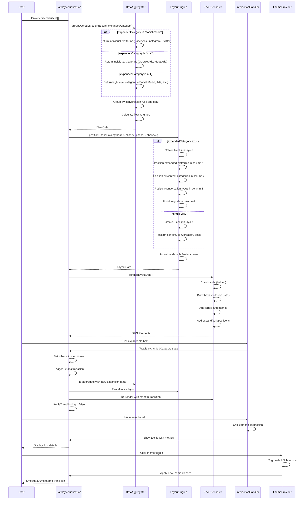

# Design Document: Sankey Flow Visualization

## Overview

The Sankey Flow Visualization feature is an interactive multi-phase flow diagram that visualizes user journeys through the platform ecosystem. The visualization supports both 3-column and 4-column layouts with hierarchical expandable nodes, allowing users to drill down from high-level categories (Social Media, Ads) into individual platforms (Facebook, Instagram, Twitter, Google Ads, Meta Ads). The system displays user flows through Content Sources (Phase 1), Conversation Types (Phase 2), and Goals (Phase 3), with curved SVG bands representing flow volumes and interactive tooltips showing detailed metrics.

The implementation features a dark theme by default with light theme toggle, multi-select filters with tag-based UI, and smooth 500ms transitions for expand/collapse animations. Built with React components, TypeScript for type safety, SVG for rendering curved flow paths, and Tailwind CSS for styling. The design prioritizes performance through efficient data aggregation algorithms and smooth interactive experiences.

## Architecture

```mermaid
graph TD
    A[SankeyVisualization Component] --> B[Data Aggregation Layer]
    A --> C[Layout Engine]
    A --> D[SVG Rendering Layer]
    A --> E[Interaction Layer]
    A --> F[Theme System]
    
    B --> B1[Hierarchical Grouping]
    B --> B2[Flow Calculator]
    B --> B3[Box Metrics Computer]
    
    C --> C1[Dynamic Column Layout]
    C --> C2[Box Positioner]
    C --> C3[Band Router]
    
    D --> D1[Box Renderer with Clip Paths]
    D --> D2[Band Path Generator]
    D --> D3[Label Renderer]
    D --> D4[Expand/Collapse Icons]
    
    E --> E1[Click Handler for Expansion]
    E --> E2[Hover Handler]
    E --> E3[Tooltip Manager]
    E --> E4[Transition State Manager]
    
    F --> F1[ThemeProvider Context]
    F --> F2[ThemeToggle Component]
    F --> F3[CSS Class Management]
    
    G[Filters Component] --> G1[Multi-Select Dropdowns]
    G --> G2[Tag Display System]
    G --> G3[Filter State Manager]
    
    style A fill:#4F46E5
    style B fill:#10B981
    style C fill:#F59E0B
    style D fill:#EF4444
    style E fill:#8B5CF6
    style F fill:#06b6d4
    style G fill:#ec4899
```



## Main Algorithm/Workflow




## Core Data Types and Hierarchical Structure

### Medium Types

The system supports the following content source types:

```typescript
type Medium = 
  | 'facebook' 
  | 'instagram' 
  | 'twitter' 
  | 'google-ads' 
  | 'meta-ads' 
  | 'youversion' 
  | 'website' 
  | 'ai' 
  | 'daily-devotionals';
```

**Hierarchical Grouping:**
- **Social Media** (expandable category)
  - Facebook
  - Instagram
  - Twitter
- **Ads** (expandable category)
  - Google Ads
  - Meta Ads
- **Individual Platforms** (non-expandable)
  - YouVersion
  - Website
  - AI Chat
  - Daily Devotionals

### Conversation Types

```typescript
type ConversationType = 'comments' | 'dm' | 'courses';
```

**Note:** The 'chat' conversation type was removed from the original design.

### Goal Types

```typescript
type Goal = 'church';
```

**Note:** Only the 'church' goal exists now. The 'conversation' goal was removed.

### User Data Model

```typescript
interface User {
  id: string;
  name: string;
  email: string;
  medium: Medium;
  conversationType?: ConversationType;
  language: string;
  brand: string;
  country: Country;  // NEW: Country field added
  date: string;
  status: 'active' | 'inactive';
  phase: Phase;
  goal: Goal;
  engagementLevel: number;
}
```

## Layout Engine Specifications

### Layout Constants

```typescript
const BOX_WIDTH = 180;              // Increased from 160px
const MIN_BOX_HEIGHT = 80;          // Increased from 40px
const MAX_BOX_HEIGHT = 300;         // Increased from 200px
const MIN_VERTICAL_SPACING = 15;    // Reduced from 30px
const PHASE_HORIZONTAL_SPACING = 250; // Reduced from 350px
const CANVAS_PADDING = 40;          // Reduced from 60px
```

### Dynamic Column Layout

The layout engine supports two modes:

**3-Column Layout (Default):**
- Column 1: Content categories (Social Media, Ads, YouVersion, Website, AI, Daily Devotionals)
- Column 2: Conversation types (Comments, DM, Courses)
- Column 3: Goals (Church)

**4-Column Layout (Expanded):**
- Column 1: Expanded individual platforms (e.g., Facebook, Instagram, Twitter)
- Column 2: All content categories including the expanded one (with "Content" heading)
- Column 3: Conversation types (with "Conversation" heading)
- Column 4: Goals (with "Goal" heading)

### Expansion Algorithm

```pascal
ALGORITHM handleExpansion(clickedBox)
INPUT: clickedBox (PhaseBox with isExpandable = true)
OUTPUT: New layout with expanded view

PRECONDITIONS:
  - clickedBox.isExpandable = true
  - clickedBox.children is defined and non-empty
  - isTransitioning = false

BEGIN
  SET isTransitioning ← true
  
  // Normalize category name for comparison
  normalizedCategory ← clickedBox.label.toLowerCase().replace(/\s+/g, '-')
  
  IF expandedCategory = normalizedCategory THEN
    // Collapse: return to 3-column layout
    SET expandedCategory ← null
  ELSE
    // Expand: switch to 4-column layout
    SET expandedCategory ← normalizedCategory
  END IF
  
  // Trigger smooth 500ms CSS transition
  TRIGGER_TRANSITION(duration: 500ms)
  
  // Re-aggregate data with new expansion state
  phase1Data ← groupUsersByMedium(users, expandedCategory)
  
  IF expandedCategory ≠ null THEN
    allContentData ← groupUsersByMedium(users, null)
    layout ← positionPhaseBoxes(phase1Data, allContentData, phase2Data, phase3Data)
  ELSE
    layout ← positionPhaseBoxes(phase1Data, phase2Data, phase3Data)
  END IF
  
  // Re-render with new layout
  RENDER(layout)
  
  // Wait for transition to complete
  WAIT(500ms)
  SET isTransitioning ← false
END

POSTCONDITIONS:
  - Layout reflects new expansion state
  - All transitions completed smoothly
  - isTransitioning = false
```

## Theme System

### ThemeProvider Architecture

The theme system uses React Context to manage global theme state:

```typescript
interface ThemeContextType {
  theme: 'dark' | 'light';
  toggleTheme: () => void;
}
```

**Default Theme:** Dark mode

**Theme Application:**
- Theme class ('dark' or 'light') applied to document root
- All components styled with conditional classes (e.g., `bg-[#1a1f2e] light:bg-white`)
- Smooth 300ms transitions between themes

**Color Scheme:**
- **Dark Theme:** Uses blue-gray tints (#1a1f2e, #2d3548) instead of pure grays
- **Light Theme:** Uses white and light gray backgrounds

### Theme Toggle Component

Located in top-right corner of the interface. Provides instant theme switching with visual feedback.

## Filter System

### Multi-Select Filters

The following filters support multi-select with tag-based display:

1. **Country Filter**
   - Multi-select dropdown
   - Selected countries shown as blue tags with × buttons
   - Dropdown arrow indicator

2. **Brand/Content Filter**
   - Multi-select dropdown with grouped options
   - Two option groups: "Brands" and "Content Sources"
   - Selected items shown as purple tags with × buttons
   - Supports both brand names (Biblword, SheRises, etc.) and content sources (Facebook, Instagram, etc.)

3. **Conversation Filter**
   - Multi-select dropdown
   - Selected types shown as green tags with × buttons
   - Options: Comments, DM, Courses

### Single-Select Filters

1. **Language Filter**
   - Single-select dropdown
   - Standard dropdown styling with arrow indicator

2. **Phase Filter**
   - Single-select dropdown
   - Options: Evangelism, Discipleship, Leadership

### Filter UI Design

**Compact Horizontal Layout:**
- All filters on one line
- Minimal height for compact appearance
- Font size: xs (12px)
- Dark theme backgrounds for dropdowns
- Custom scrollbars for dropdown options
- Hover effects and selected option highlighting

**Reset Button:**
- Located at the end of the filter row
- Gradient background (red/orange)
- Clears all filters except date range
- Icon + text label

## Color Scheme

### Updated COLOR_MAP

```typescript
export const COLOR_MAP: Record<string, string> = {
  // Individual platforms
  facebook: '#3b82f6',
  instagram: '#ec4899',
  twitter: '#1da1f2',
  'google-ads': '#4285f4',
  'meta-ads': '#0668e1',
  youversion: '#8b5cf6',
  website: '#10b981',
  ai: '#06b6d4',
  'daily-devotionals': '#ef4444',
  
  // Categories - Different colors for Social Media and Ads
  'social-media': '#3b82f6',  // Blue for Social Media
  'Social Media': '#3b82f6',
  'ads': '#f59e0b',           // Orange for Ads
  'Ads': '#f59e0b',
  
  // Conversation types
  comments: '#60a5fa',
  dm: '#a78bfa',
  'Direct Messages': '#a78bfa',
  'Comments': '#60a5fa',
  'Courses': '#ef4444',
  
  // Goals
  church: '#34d399',
  'Church': '#34d399',
};
```

**Key Change:** Social Media uses blue (#3b82f6) and Ads uses orange (#f59e0b) for visual distinction.

## SVG Rendering with Clip Paths

### Text Overflow Prevention

Each box uses SVG clip paths to prevent text overflow:

```xml
<defs>
  <clipPath id="clip-{box.id}">
    <rect x={box.x} y={box.y} width={box.width} height={box.height} rx={8} />
  </clipPath>
</defs>

<g clipPath="url(#clip-{box.id})">
  <!-- Text elements clipped to box bounds -->
</g>
```

**Benefits:**
- Text never overflows box boundaries
- No need for text squeezing or ellipsis
- Clean visual appearance
- Works with any text length

### Expand/Collapse Icons

Rendered OUTSIDE the clip path to remain visible:

```xml
<text x={box.x + box.width - 15} y={box.y + 22}>
  {expandedCategory === box.label ? '−' : '+'}
</text>
```

## Interactive Map (Hidden)

An InteractiveMap component was created using Leaflet and React-Leaflet:

**Features:**
- Displays world map with animated colored rings on 6 major regions
- Pulse animations for visual interest
- Currently commented out in page.tsx per user request

**Status:** Implementation complete but hidden. Can be re-enabled if needed.

## Correctness Properties

*A property is a characteristic or behavior that should hold true across all valid executions of a system—essentially, a formal statement about what the system should do. Properties serve as the bridge between human-readable specifications and machine-verifiable correctness guarantees.*

### Property 1: Hierarchical Grouping Correctness

*For any* list of users, when Social Media or Ads category is expanded, the sum of users in individual platforms (Facebook + Instagram + Twitter, or Google Ads + Meta Ads) should equal the total users in the collapsed category.

**Validates: Hierarchical expandable nodes feature**

### Property 2: User Grouping Completeness

*For any* list of users, when grouped by any field (medium, conversationType, or goal), every user should appear in exactly one group, and the sum of all group sizes should equal the total number of users.

**Validates: Requirements 1.1, 1.2, 1.3, 1.7**

### Property 3: Expansion State Consistency

*For any* expansion operation, if expandedCategory is set to a normalized category name (lowercase, spaces replaced with hyphens), the layout should switch to 4-column mode and display individual platforms in column 1.

**Validates: Hierarchical expansion algorithm**

### Property 4: Transition State Management

*For any* expand/collapse operation, isTransitioning should be true during the 500ms animation and false before and after, preventing concurrent expansion operations.

**Validates: Smooth transition behavior**

### Property 5: Flow Count Accuracy

*For any* list of users, the sum of all flow volumes between any two phases should equal the number of users that have values for both phase attributes (accounting for users with undefined conversationType).

**Validates: Requirements 1.4, 1.5, 1.6**

### Property 6: Multi-Select Filter Consistency

*For any* multi-select filter (Country, Brand/Content, Conversation), the displayed tags should exactly match the selected values in the filter state, and removing a tag should update the filter state accordingly.

**Validates: Multi-select filter system**

### Property 7: Theme Application Completeness

*For any* theme toggle operation, all components should receive the new theme class within 300ms, and all theme-dependent styles should update smoothly.

**Validates: Theme system**

### Property 8: Percentage Calculation Correctness

*For any* phase with multiple boxes, the sum of all box percentages should equal 100% (within rounding tolerance of 0.1%).

**Validates: Requirements 1.8**

### Property 9: Dynamic Column Layout Correctness

*For any* expansion state, if expandedCategory is null, the layout should have 3 columns; if expandedCategory is set, the layout should have 4 columns with correct phase positioning.

**Validates: Dynamic column layout algorithm**

### Property 10: Phase Column Positioning

*For any* layout calculation in 3-column mode, Phase 1 boxes should be in the left third, Phase 2 in the middle third, and Phase 3 in the right third. In 4-column mode, columns should be evenly distributed.

**Validates: Requirements 2.1, 2.2, 2.3**

### Property 11: Vertical Spacing Uniformity

*For any* set of boxes within a single phase, the vertical spacing between consecutive boxes should be MIN_VERTICAL_SPACING (15px).

**Validates: Requirements 2.4**

### Property 12: Box Height Proportionality

*For any* two boxes in the same phase, the ratio of their heights should equal the ratio of their user counts (subject to MIN_BOX_HEIGHT = 80px and MAX_BOX_HEIGHT = 300px constraints).

**Validates: Requirements 2.5, 2.6**

### Property 13: Box Dimension Constraints

*For any* rendered box, width should equal BOX_WIDTH (180px), and height should be between MIN_BOX_HEIGHT (80px) and MAX_BOX_HEIGHT (300px).

**Validates: Layout constants**

### Property 14: Valid Bezier Control Points

*For any* flow band, the calculated Bezier control points should lie between the source and destination boxes horizontally, ensuring smooth curves.

**Validates: Requirements 2.10**

### Property 15: SVG Clip Path Effectiveness

*For any* box with text content, all text elements should be clipped to the box boundaries using the clip path, preventing overflow.

**Validates: SVG rendering with clip paths**

### Property 16: Expand Icon Visibility

*For any* expandable box, the expand/collapse icon (+ or −) should be rendered outside the clip path and remain visible regardless of box content.

**Validates: Expand/collapse icon rendering**

### Property 17: SVG Element Completeness

*For any* phase box, the rendered SVG should contain a rectangle element, clip path definition, text elements for count/label/percentage, and expand icon if applicable.

**Validates: Requirements 3.1, 3.2, 3.3, 3.4**

### Property 18: Band Stroke Width Proportionality

*For any* two flow bands, the ratio of their stroke widths should equal the ratio of their flow volumes (with minimum stroke width of 2px).

**Validates: Requirements 3.6**

### Property 19: Color Distinction for Categories

*For any* rendering, Social Media category should use blue (#3b82f6) and Ads category should use orange (#f59e0b) for visual distinction.

**Validates: Updated color scheme**

### Property 20: Color Inheritance and Transparency

*For any* flow band, the band color should match the source box color with reduced opacity (0.4 normally, 0.8 on hover).

**Validates: Requirements 3.7**

### Property 21: Z-Order Correctness

*For any* rendered visualization, all flow band elements should appear before (behind) all phase box elements in the SVG DOM tree.

**Validates: Requirements 3.8**

### Property 22: Tooltip Content Completeness

*For any* flow band, when hovered, the displayed tooltip should contain the source label, destination label (with LABEL_MAP applied), flow volume, and percentage.

**Validates: Requirements 4.2, 4.3, 4.4, 4.5**

### Property 23: Tooltip Positioning

*For any* mouse position over a flow band, the tooltip should be positioned at (mouseX + 10, mouseY + 10) and remain within the viewport bounds.

**Validates: Requirements 4.6**

### Property 24: Hover State Transitions

*For any* interactive element (box or band), hovering should trigger visual changes (opacity, shadow, or scale), and un-hovering should restore the original state within 300ms.

**Validates: Requirements 5.1, 5.2, 5.3, 5.4, 5.5**

### Property 25: Click Handler for Expansion

*For any* expandable box, clicking should toggle the expandedCategory state only if isTransitioning is false, preventing concurrent operations.

**Validates: Interaction layer**

### Property 26: Zero-Value Filtering

*For any* aggregated data, boxes with zero users and bands with zero flow volume should not appear in the rendered output.

**Validates: Requirements 6.3, 6.4**

### Property 27: Filter Tag Display Accuracy

*For any* multi-select filter with selected values, each selected value should be displayed as a tag with a × button, and clicking × should remove that value from the filter state.

**Validates: Tag-based filter UI**

### Property 28: Theme Toggle Responsiveness

*For any* theme toggle action, the theme state should update immediately, and all components should reflect the new theme within 300ms.

**Validates: Theme system responsiveness**

### Property 29: Transition Opacity Control

*For any* expand/collapse operation, band opacity should be reduced to 0.3 during the transition (isTransitioning = true) and restored to normal after completion.

**Validates: Smooth visual transitions**

### Property 30: Country Field Presence

*For any* user in the system, the country field should be defined and be one of the valid Country type values.

**Validates: Updated user data model**

### Property 31: Conversation Type Validity

*For any* user with a defined conversationType, the value should be one of: 'comments', 'dm', or 'courses' (not 'chat').

**Validates: Updated conversation types**

### Property 32: Goal Type Validity

*For any* user, the goal field should equal 'church' (the only valid goal type).

**Validates: Updated goal types**

### Property 33: Medium Type Validity

*For any* user, the medium field should be one of: 'facebook', 'instagram', 'twitter', 'google-ads', 'meta-ads', 'youversion', 'website', 'ai', or 'daily-devotionals' (not 'courses').

**Validates: Updated medium types**

### Property 34: Complete Flow Connectivity

*For any* rendered visualization with all conversation types present, every content source box should have at least one flow connection to each conversation type box (Comments, DM, Courses), ensuring complete visibility of user journey patterns.

**Validates: Complete flow connectivity requirement**

