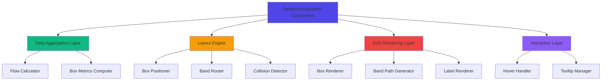

# Design Document: Sankey Flow Visualization

## Overview

The Sankey Flow Visualization feature transforms the current static box-based user journey visualization into an interactive three-phase flow diagram. The visualization displays user flows through three distinct phases: Content Sources (Phase 1), Conversation Types (Phase 2), and Goals (Phase 3). The design uses curved SVG bands (Sankey-style ribbons) to represent user flows between phases, with band widths proportional to flow volumes and interactive tooltips showing detailed metrics. This approach provides intuitive visual representation of user journey patterns, conversion rates, and drop-off points across the platform ecosystem.

The implementation leverages React components with TypeScript for type safety, SVG for rendering curved flow paths, and Tailwind CSS for styling. The design prioritizes performance through efficient data aggregation algorithms, collision detection for optimal band positioning, and smooth interactive experiences through hover states and tooltips.

## Architecture



## Main Algorithm/Workflow

```mermaid
sequenceDiagram
    participant User
    participant Component as SankeyVisualization
    participant Aggregator as DataAggregator
    participant Layout as LayoutEngine
    participant SVG as SVGRenderer
    participant Interaction as InteractionHandler
    
    User->>Component: Provide filtered users[]
    Component->>Aggregator: aggregateFlows(users)
    Aggregator->>Aggregator: Group by medium, conversationType, goal
    Aggregator->>Aggregator: Calculate flow volumes
    Aggregator-->>Component: FlowData
    
    Component->>Layout: calculateLayout(flowData)
    Layout->>Layout: Position boxes vertically
    Layout->>Layout: Route bands with collision detection
    Layout->>Layout: Calculate curve control points
    Layout-->>Component: LayoutData
    
    Component->>SVG: render(layoutData)
    SVG->>SVG: Draw boxes
    SVG->>SVG: Draw curved bands
    SVG->>SVG: Add labels
    SVG-->>Component: SVG Elements
    
    User->>Interaction: Hover over band
    Interaction->>Interaction: Calculate tooltip position
    Interaction->>Component: Show tooltip with metrics
    Component-->>User: Display flow details


## Correctness Properties

*A property is a characteristic or behavior that should hold true across all valid executions of a system—essentially, a formal statement about what the system should do. Properties serve as the bridge between human-readable specifications and machine-verifiable correctness guarantees.*

### Property 1: User Grouping Completeness

*For any* list of users, when grouped by any field (medium, conversationType, or goal), every user should appear in exactly one group, and the sum of all group sizes should equal the total number of users.

**Validates: Requirements 1.1, 1.2, 1.3, 1.7**

### Property 2: Flow Count Accuracy

*For any* list of users, the sum of all flow volumes between any two phases should equal the number of users that have values for both phase attributes (accounting for users with undefined conversationType).

**Validates: Requirements 1.4, 1.5, 1.6**

### Property 3: Percentage Calculation Correctness

*For any* phase with multiple boxes, the sum of all box percentages should equal 100% (within rounding tolerance of 0.1%).

**Validates: Requirements 1.8**

### Property 4: Phase Column Positioning

*For any* layout calculation, all Phase 1 boxes should have x-coordinates in the left third of the canvas, Phase 2 boxes in the middle third, and Phase 3 boxes in the right third.

**Validates: Requirements 2.1, 2.2, 2.3**

### Property 5: Vertical Spacing Uniformity

*For any* set of boxes within a single phase, the vertical spacing between consecutive boxes should be equal (within 1 pixel tolerance).

**Validates: Requirements 2.4**

### Property 6: Box Height Proportionality

*For any* two boxes in the same phase, the ratio of their heights should equal the ratio of their user counts (subject to minimum height constraints).

**Validates: Requirements 2.5, 2.6**

### Property 7: Collision-Free Band Routing

*For any* set of flow bands after layout calculation, no two bands should overlap (intersect) at any point along their paths.

**Validates: Requirements 2.8, 2.9**

### Property 8: Valid Bezier Control Points

*For any* flow band, the calculated Bezier control points should lie between the source and destination boxes horizontally, ensuring smooth curves.

**Validates: Requirements 2.10**

### Property 9: SVG Element Completeness

*For any* phase box, the rendered SVG should contain a rectangle element, text elements for label and metrics, and appropriate styling attributes.

**Validates: Requirements 3.1, 3.2, 3.3, 3.4**

### Property 10: Band Stroke Width Proportionality

*For any* two flow bands, the ratio of their stroke widths should equal the ratio of their flow volumes.

**Validates: Requirements 3.6**

### Property 11: Color Inheritance and Transparency

*For any* flow band, the band color should match the source box color with reduced opacity (alpha channel between 0.3 and 0.7).

**Validates: Requirements 3.7**

### Property 12: Z-Order Correctness

*For any* rendered visualization, all flow band elements should appear before (behind) all phase box elements in the SVG DOM tree.

**Validates: Requirements 3.8**

### Property 13: Tooltip Content Completeness

*For any* flow band, when hovered, the displayed tooltip should contain the source label, destination label, flow volume, and percentage.

**Validates: Requirements 4.2, 4.3, 4.4, 4.5**

### Property 14: Tooltip Positioning

*For any* mouse position over a flow band, the tooltip should be positioned within 50 pixels of the cursor and remain within the viewport bounds.

**Validates: Requirements 4.6**

### Property 15: Hover State Transitions

*For any* interactive element (box or band), hovering should trigger visual changes (opacity, shadow, or scale), and un-hovering should restore the original state.

**Validates: Requirements 5.1, 5.2, 5.3, 5.4, 5.5**

### Property 16: Zero-Value Filtering

*For any* aggregated data, boxes with zero users and bands with zero flow volume should not appear in the rendered output.

**Validates: Requirements 6.3, 6.4**

### Property 17: Aspect Ratio Preservation

*For any* viewport size change, the visualization's aspect ratio should remain constant when scaling.

**Validates: Requirements 7.4**

### Property 18: Hover Event Debouncing

*For any* sequence of rapid hover events (less than 100ms apart), only the final event should trigger a tooltip update.

**Validates: Requirements 8.4**

### Property 19: ARIA Label Presence

*For any* interactive element (phase box or flow band), an aria-label attribute should be present with descriptive text.

**Validates: Requirements 9.1, 9.2**

### Property 20: Keyboard Focus Visibility

*For any* phase box, when it receives keyboard focus, a visible focus outline should be rendered.

**Validates: Requirements 9.3**

### Property 21: Color Contrast Compliance

*For any* text element rendered on a colored background, the color contrast ratio should be at least 4.5:1 to meet WCAG AA standards.

**Validates: Requirements 9.4**

### Property 22: Color Mapping Correctness

*For any* box category (medium, conversation type, or goal), the applied color gradient should match the predefined color scheme for that category.

**Validates: Requirements 10.1, 10.2, 10.3, 10.4, 10.5, 10.6, 10.7, 10.9, 10.10**

### Property 23: Color Distinctness

*For any* two boxes with different categories in the same phase, their colors should be visually distinct (color distance > 30 in RGB space).

**Validates: Requirements 10.8**
